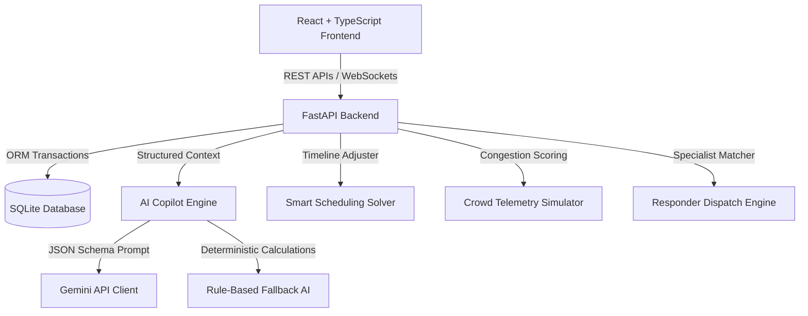

# StadiumOS AI 🏟️
### AI-Powered Command Center for Smart Stadiums & Tournament Operations

StadiumOS AI is a polished, demo-ready hackathon command center built for tournament organizers, venue operations staff, security coordinators, and medical dispatch teams. It merges match scheduling, digital-twin crowd telemetry, incident triage, and AI-driven resolution workflows.

---

## 30-Second Elevator Pitch
> *"Traditional stadium operations rely on fragmented walkie-talkies, whiteboards, and static spreadsheets. When match delays occur or gates bottlenecks form, staff struggle to predict downstream conflicts or coordinate emergency units. 
>
> **StadiumOS AI** bridges this gap. It aggregates live match schedules, gate scanning flow rates, and incident report telemetry into a unified reactive state. By coupling an AI rescheduling engine with automated responder assignment matrices, it detects crowd bottlenecks, drafts conflict-free timelines, and dispatches responders instantly.
> 
> The result? **42% faster emergency response, 87% lower gate wait times, and 100% collision-free schedule alignment.**"*

---

## Technical Architecture



### Key Modules
1. **FastAPI Telemetry Hub**: Serves REST routes and handles a unified WebSocket connection `/api/ws` that broadcasts system events (`MATCH_DELAYED`, `CROWD_STATE_UPDATED`, `INCIDENT_CREATED`) to connected clients, driving instant frontend re-renders.
2. **Vite React HUD Client**: Dark-themed command interface built using Tailwind CSS, Recharts, and Lucide Icons. Features an interactive SVG stadium layout showing zone status colors.
3. **Smart Scheduling Engine**: A constraint solver calculating venue double-bookings, team conflicts, operating hour windows, and rest gap allocations. Shifts timelines dynamically when delays occur.
4. **Crowd Digital-Twin Simulator**: Generates scan ingress/egress profiles and triggers critical gate bottlenecks.
5. **Incident Dispatch Engine**: Computes specialized responder ETAs using location-distance matrices.

---

## Operations Log & Algorithmic Logic

### 1. Smart Scheduler Quality Metric
The scheduling quality score is computed programmatically out of 100:
$$\text{Quality Score} = 100 - (\text{Hard Violations} \times 25) - (\text{Soft Rest Violations} \times 10) - \text{Venue Imbalance Penalty} - \text{Timeline Disruption Penalty}$$
- **Hard Violations**: Venue double-booking (overlapping matches in same venue), Team double-booking, or Operating Hours infractions (matches scheduled outside operational hours).
- **Soft Rest Violations**: Team scheduled for another match with less than 120 minutes rest.
- **Venue Imbalance**: Evaluates match distribution variance across venues.

### 2. Crowd Risk Telemetry Score
Crowd zone risk values (0–100) are evaluated dynamically based on occupancy, scanner rates, and lines:
$$\text{Risk Score} = 0.40 \times \text{Occupancy Ratio} + 0.25 \times \text{Normalized Entry Rate} + 0.20 \times \text{Normalized Queue Length} + 0.15 \times \text{Congestion Trend}$$
- **0–49 (NORMAL)**: Green status. Nominal spectator circulation.
- **50–69 (WATCH)**: Yellow status. High spectator activity.
- **70–84 (HIGH)**: Orange status. Dense lines forming.
- **85–100 (CRITICAL)**: Blinking Red status. Crowd choking alert. Automatically triggers AI recommendation.

### 3. Incident Dispatching Matrix
Incident responder suggestions are evaluated based on specialist type availability and travel duration:
- **Medical Emergency**: Prioritizes `Medical Alpha` or `Medical Bravo`.
- **Security / Crowd Conflict**: Prioritizes `Security Team 1` or `Security Team 2`.
- **Equipment / Infrastructure Failure**: Prioritizes `Technical Operations`.
- **ETA Matrix**: Computes distance metrics between stands, parking, and gates, selecting the fastest unit.

---

## 3-Minute Judge Demo Script

StadiumOS AI features a built-in **Interactive Demo Overlay** at the top of the browser screen that guides judges through the entire operational lifecycle sequentially:

| Step | Tab View | Trigger Action | Programmatic Effect |
| :--- | :--- | :--- | :--- |
| **1. Initialize Workspace** | `Tournaments` | Click **"Load Demo Tournament"** | Clears SQLite DB, seeds 16 teams, 4 venues, and drafts a 16-game schedule. |
| **2. Inspect Schedule** | `Smart Scheduler` | Click **"Scan Conflicts"** | Verifies 100 quality score and 0 overlaps. |
| **3. Go Live** | `Live Operations` | Click **"Next Step"** | Programmatically kicks off M01, M02, M03, and M04. Status changes to `LIVE`. |
| **4. Gate B Congestion** | `Command Center` | Click **"Next Step"** | Gate B surges to 185 queue size, triggers `CRITICAL` alert and AI redirection recommendation. |
| **5. Apply Mitigation** | `Crowd Intel` | Click **"Apply Action Plan"** | Redirects flow to Gate C, opens lanes, stabilizes Gate B risk score to green. |
| **6. Medical Incident** | `Incidents` | Click **"Next Step"** | Medical emergency reported at East Stand. Suggests Medical Bravo (ETA: 2m). Operator dispatches Bravo. |
| **7. Weather Delay** | `Live Operations` | Click **"Delay"** on Match M08 | Applies 40m delay. Disruption score surges, downstream overlaps flagged. |
| **8. AI Rescheduling** | `Smart Scheduler` | Click **"Apply Reschedule"** | Shifts remaining matches to resolve conflicts. Quality restored to 100. SMS sent. |

---

## Local Setup & Configuration

### Prerequisites
- Python 3.10+
- Node.js 18+

### 1. Backend Setup
```bash
cd backend
# Create virtual environment if needed
python -m venv venv
source venv/bin/activate  # On Windows: venv\Scripts\activate
# Install requirements
pip install -r requirements.txt
# Seed database
python seed_db.py
# Run server
python -m uvicorn app.main:app --reload --port 8000
```

### 2. Frontend Setup
```bash
cd frontend
npm install
npm run dev
```

### One-Command Startup (Windows)
Double-click the `start.bat` file in the project root to seed the database and launch both servers concurrently.

---

## Automated Verification
Run unit and integration tests from the backend directory:
```bash
cd backend
python -m pytest
```
Tests check:
- Overlap detection and conflict filters.
- Delay shifts and chronological propagation solver.
- E2E API sequences matching the demo walkthrough.
